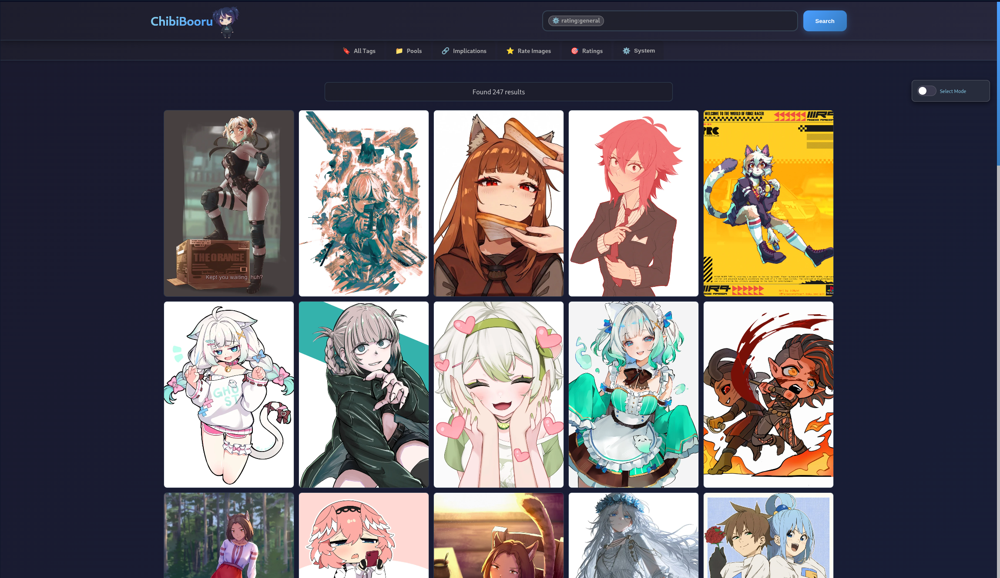
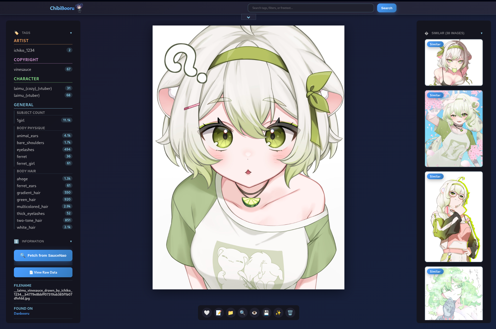

# ChibiBooru

A self-hosted booru type app for organizing and browsing your local image collection with automated metadata fetching and tagging. ChibiBooru combines a user-friendly interface with powerful backend tools to create a rich, searchable media library similar to popular image boorus.

## Table of Contents

- [Features](#features)
- [Quick Start](#quick-start)
- [Installation](#installation)
- [Configuration](#configuration)
- [Usage](#usage)
- [Project Structure](#project-structure)
- [Development](#development)
- [Advanced Topics](#advanced-topics)

---

## Screenshots


*Gallery view with rating:general filter showing safe content*


*Image detail page with tag editor and metadata viewer*

---

## Features

### 🎨 Automated Metadata & Tagging

- **Multi-Source Tag Fetching:**
  - **Direct Hash Matching:** Finds metadata from Danbooru, e621, Gelbooru, and Yandere using MD5 hash
  - **Pixiv Integration:** Fetches tags and artist info from Pixiv, automatically complemented with local AI tagging
  - **Reverse Image Search:** Uses SauceNao to discover sources when direct matching fails
  - **AI Tagging:** Local ONNX-based tagger analyzes images with no online matches
  - **Flexible Source Switching:** View tags from different sources or merge them all together

- **AI Rating Inference:** Automatic content rating detection (Safe, Questionable, Explicit) with confidence scores

### 🔍 Advanced Search System

- **Tag Search:** Intelligent autocomplete with category-specific filtering (`character:name`, `artist:name`, `copyright:series`)
- **Full-Text Search:** FTS5-powered fuzzy matching and partial tag search
- **Negative Filters:** Exclude tags with `-` prefix (e.g., `-sketch`)
- **File Filters:** Search by filename (`filename:text`) or extension (`.png`, `.gif`)
- **Relationship Filters:** Find parent/child images (`has:parent`, `has:child`, `has:relationship`)
- **Pool Search:** Find images in collections (`pool:series_name`)
- **Source Filtering:** Filter by metadata source (`source:danbooru`)
- **Smart Similarity:** Weighted similarity matching that prioritizes rare tags and important categories

### 🏷️ Tag Management

- **Full Tag Control:**
  - Inline tag editor with category management
  - Switch between metadata sources on-the-fly
  - Tag delta tracking preserves manual edits across rebuilds
  
- **Tag Implications:**
  - Automatic detection via naming patterns and statistical analysis
  - Manual creation and approval workflow
  - Chain preview to see full impact before applying

### 📚 Organization Tools

- **Pools:** Create named collections with custom image ordering
- **Relationships:** Automatic parent/child relationship detection and display
- **Tag Browser:** Browse all tags by category with usage statistics

### ⚙️ System Management

- **Authentication:** Password-protected web interface with session-based login
- **Image Upload:** Drag-and-drop interface with automatic processing
- **Ingest Folder:** Drop images in the ingest folder for automated processing
- **Background Monitor:** Optional service that watches for new files and processes them automatically
- **Debug Panel:** Comprehensive tools for database maintenance, optimization, and bulk operations
- **Health Checks:** Automatic startup health checks with self-repair capabilities

---

## Quick Start

```bash
# Clone and install
git clone <repository-url>
cd Booru
python -m venv venv
source venv/bin/activate  # Windows: venv\Scripts\activate
pip install -r requirements.txt

# Configure
cp .env.example .env
# Edit .env with your settings (set APP_PASSWORD, SECRET_KEY, RELOAD_SECRET)

# Run
python app.py
# Visit http://127.0.0.1:5000
```

---

## Installation

### Prerequisites

- Python 3.8 or higher
- Git (for cloning the repository)

### Step-by-Step Installation

1. **Clone the repository:**
   ```bash
   git clone <repository-url>
   cd Booru
   ```

2. **Create a virtual environment** (highly recommended):
   ```bash
   python -m venv venv
   source venv/bin/activate  # On Windows: venv\Scripts\activate
   ```

3. **Install dependencies:**
   ```bash
   pip install -r requirements.txt
   ```

4. **Optional: Install AI tagging dependencies:**
   ```bash
   pip install -r requirements-ai.txt
   ```

5. **Optional: Download tagger model:**

   If you need an ONNX tagger model, [Camie Tagger v2](https://huggingface.co/Camais03/camie-tagger-v2) is a good option.

   **Quick setup:**
   ```bash
   python scripts/download_tagger.py
   ```

   **Manual download:**
   Place these files in `models/Tagger/`:
   - [camie-tagger-v2.onnx](https://huggingface.co/Camais03/camie-tagger-v2/resolve/main/camie-tagger-v2.onnx) → rename to `model.onnx`
   - [camie-tagger-v2-metadata.json](https://huggingface.co/Camais03/camie-tagger-v2/resolve/main/camie-tagger-v2-metadata.json) → rename to `metadata.json`

6. **Optional: Install development dependencies:**
   ```bash
   pip install -r requirements-dev.txt
   ```

---

## Configuration

### Environment Setup

Copy the example configuration file:

```bash
cp .env.example .env
```

### Required Settings

Edit `.env` and set these **required** values:

```env
# REQUIRED: Change these before first use!
APP_PASSWORD="your-secure-password"
SECRET_KEY="your-secret-key-for-sessions"  # Generate with: python -c "import secrets; print(secrets.token_hex(32))"
RELOAD_SECRET="your-reload-secret"
```

### Optional Settings

```env
# Application
APP_NAME="ChibiBooru"

# API Keys (optional, but recommended)
SAUCENAO_API_KEY="your_saucenao_api_key"  # Get from https://saucenao.com/user.php
GELBOORU_API_KEY=""
GELBOORU_USER_ID=""

# AI Tagging
LOCAL_TAGGER_NAME="CamieTagger"  # Display name for your AI tagger

# Web Server
FLASK_HOST="0.0.0.0"  # 0.0.0.0 allows external connections
FLASK_PORT="5000"
FLASK_DEBUG="false"

# Similarity
SIMILARITY_METHOD="weighted"  # Options: 'jaccard' or 'weighted'
```

### AI Tagger Models

Use any ONNX-based tagging model:

1. Place `model.onnx` and `metadata.json` in `models/Tagger/`
2. Update `LOCAL_TAGGER_NAME` in `.env`
3. Adjust `LOCAL_TAGGER_THRESHOLD` in `config.py` if needed

Compatible models include:

- [Camie Tagger v2](https://huggingface.co/Camais03/camie-tagger-v2) (use `python scripts/download_tagger.py`)
- WD14 (WaifuDiffusion) tagger variants
- Z3D-E621 tagger
- Other ONNX-based image taggers

### Security Best Practices

> [!CAUTION]
> - **Always change** `APP_PASSWORD`, `SECRET_KEY`, and `RELOAD_SECRET` before deployment
> - **Never commit** your `.env` file to version control (already in `.gitignore`)
> - Use strong, random values for all secrets
> - Keep API keys private and secure

### Directory Setup

Place your image collection in:
```
static/images/
```

You can organize images in subdirectories. ChibiBooru will scan recursively.

Optionally, use the ingest folder for automatic processing:
```
ingest/
```

Images dropped here will be automatically detected, processed, and moved to the main collection.

---

## Usage

### Initial Setup

1. **Start the application:**
   ```bash
   python app.py
   # Or use: ./start_uvicorn.sh
   ```

2. **Open the web interface** at `http://127.0.0.1:5000`

3. **Log in** with your `APP_PASSWORD` from `.env`

4. **Open the System panel** (gear icon in header) and enter your `RELOAD_SECRET`

5. **Scan & Process Images:**
   - Click **"Scan & Process New Images"** to begin indexing
   - This fetches metadata for all images (may take time for large collections)
   - Progress is shown in real-time

6. **Optional: Start the Monitor** to automatically process new images added to `static/images/` or `ingest/`

### Searching Images

**Basic tag search:**
```
1girl blue_hair
```

**Category-specific search:**
```
character:holo
copyright:spice_and_wolf
artist:artist_name
species:wolf
```

**Advanced queries:**
```
source:danbooru              # Filter by metadata source
filename:cute_cat            # Search in filename
.png                         # Filter by extension
has:parent                   # Has parent relationship
has:child                    # Has child relationship
pool:series_name             # In specific pool
-sketch -monochrome          # Exclude tags
```

**Combined example:**
```
character:holo source:danbooru .png -sketch
```

### Uploading Images

1. Click **Upload** in the header
2. Drag and drop or select files
3. Images are automatically processed and added

**Alternatively:** Drop files in the `ingest/` folder and they'll be processed automatically

### Managing Tags

1. Click on an image to view its detail page
2. Click **"Edit Tags"** to open the inline editor
3. Add/remove tags within their categories
4. Click **"Save Tags"** when done
5. Your changes persist even through database rebuilds (delta tracking)

**Switching metadata sources:**
- Use the source dropdown to view tags from different providers
- Enable "Merged" to see tags from all sources combined

### Tag Implications

1. Navigate to **Implications** from the header menu
2. Review auto-detected suggestions:
   - **Pattern-based:** e.g., `character_(costume)_(series)` → `character_(series)`
   - **Statistical:** Tags that commonly appear together
3. Approve suggestions to apply them automatically
4. Create manual implications for custom relationships
5. View active implications and their impact

### Creating Pools

1. Go to **Pools** from the header menu
2. Click **"Create New Pool"**
3. Name your pool and add a description
4. Add images from detail pages or pool management
5. Search for pools using `pool:<name>`

---

## Project Structure

```
Booru/
├── app.py                  # Application entry point with Quart + Uvicorn
├── config.py               # Centralized configuration
├── start_uvicorn.sh        # Server startup script
│
├── services/               # Business logic layer (14 services)
│   ├── background_tasks.py      # Async background task management
│   ├── health_service.py        # Database health checks and auto-repair
│   ├── image_service.py         # Image CRUD and bulk operations
│   ├── implication_service.py   # Tag implication detection and management
│   ├── monitor_service.py       # Background file monitoring
│   ├── priority_service.py      # Source priority change detection
│   ├── processing_service.py    # Metadata fetching and image processing
│   ├── query_service.py         # Search and similarity calculations
│   ├── rating_service.py        # AI rating inference
│   ├── saucenao_service.py      # SauceNao reverse image search
│   ├── switch_source_db.py      # Metadata source switching
│   ├── system_service.py        # System operations (scan, thumbnails, etc)
│   └── tag_service.py           # Tag operations and autocomplete
│
├── routers/                # Web and API routing
│   ├── web.py                   # Main web UI routes
│   └── api/                     # RESTful API endpoints
│       ├── images.py            # Image API
│       ├── implications.py      # Implication management API
│       ├── pools.py             # Pool management API
│       ├── rating.py            # Rating inference API
│       ├── saucenao.py          # SauceNao search API
│       ├── system.py            # System management API
│       └── tags.py              # Tag management API
│
├── repositories/           # Data access layer
│   ├── data_access.py           # Core database operations
│   ├── delta_tracker.py         # Tag modification tracking
│   ├── pool_repository.py       # Pool data operations
│   ├── rating_repository.py     # Rating model database
│   └── tag_repository.py        # Tag data operations
│
├── database/               # Database layer
│   ├── core.py                  # SQLite connection and utilities
│   └── models.py                # ORM models and schema
│
├── core/                   # Core infrastructure
│   └── cache_manager.py         # Intelligent cache management
│
├── events/                 # Event handling
│   └── cache_events.py          # Cache invalidation events
│
├── utils/                  # Utility functions
│   ├── deduplication.py         # Duplicate detection (MD5-based)
│   └── file_utils.py            # File handling utilities
│
├── static/                 # Static web assets
│   ├── css/                     # Stylesheets
│   ├── js/                      # JavaScript files
│   ├── images/                  # YOUR IMAGE COLLECTION GOES HERE
│   ├── thumbnails/              # Auto-generated thumbnails
│   └── favicon.svg
│
├── templates/              # Jinja2 HTML templates
│   ├── index.html               # Main gallery view
│   ├── image.html               # Image detail page
│   ├── implications.html        # Implication management
│   ├── pools.html               # Pool management
│   ├── tags.html                # Tag browser
│   ├── upload.html              # Upload interface
│   └── ...
│
├── models/                 # AI model files
│   └── Tagger/                  # Place ONNX models here
│       ├── model.onnx
│       └── metadata.json
│
├── scripts/                # Utility scripts
│   ├── backfill_rating_sources.py
│   └── enable_wal.py
│
├── tests/                  # Test suite
│   ├── test_async_scan.py
│   ├── test_concurrency.py
│   ├── test_database.py
│   ├── test_models.py
│   ├── test_monitor_batching.py
│   └── test_query_service.py
│
├── ingest/                 # Drop images here for auto-processing
├── booru.db                # Main SQLite database (auto-created)
├── rating_model.db         # Rating model database (auto-created)
│
├── requirements.txt        # Core dependencies
├── requirements-ai.txt     # AI tagging dependencies
├── requirements-dev.txt    # Development dependencies
├── .env.example            # Example configuration
└── .env                    # Your configuration (create from .env.example)
```

---

## Advanced Topics

### Similarity Calculation Methods

Configure via `SIMILARITY_METHOD` in `.env`:

- **`jaccard`:** Simple set intersection/union. Fast and straightforward.
- **`weighted`** (default): Advanced IDF + category weighting:
  - Prioritizes rare tags over common ones
  - Weights character/copyright tags higher
  - Provides more nuanced similarity matching

**Adjust category weights** in `config.py`:

```python
SIMILARITY_CATEGORY_WEIGHTS = {
    'character': 6.0,   # Very significant
    'copyright': 3.0,   # Important
    'artist': 2.0,      # Matters
    'species': 2.5,     # Species tags
    'general': 1.0,     # Standard tags
    'meta': 0.5         # Less relevant
}
```

### Source Priority Configuration

Control which metadata source is used first in `config.py`:

```python
BOORU_PRIORITY = [
    "danbooru",     # Best categorization
    "e621",         # Good specific tags
    "gelbooru",     # Tags only
    "yandere",      # Tags only
    "pixiv",        # Pixiv metadata
    "local_tagger"  # AI fallback
]
```

**Important:** When changing `BOORU_PRIORITY`, increment `BOORU_PRIORITY_VERSION` to trigger automatic re-tagging.

