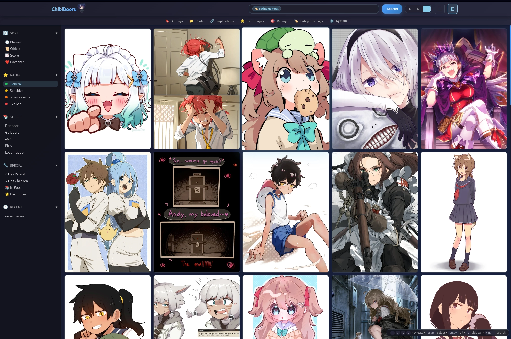
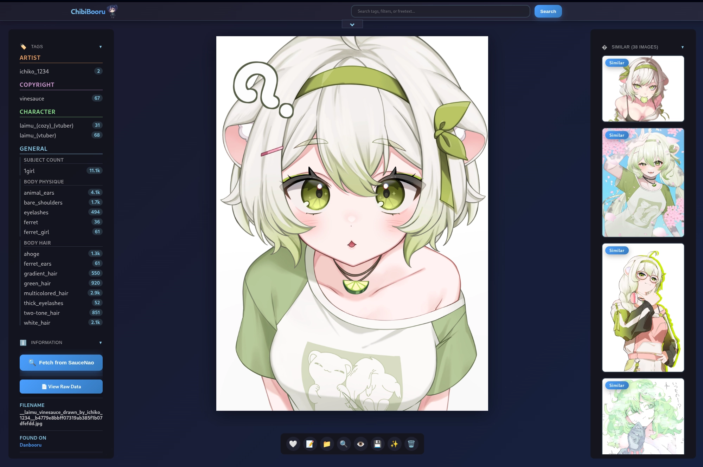

# ChibiBooru

A self-hosted booru application for organizing and browsing your local image collection with automated metadata fetching and tagging.

## Table of Contents

- [Features](#features)
- [Quick Start](#quick-start)
- [Installation](#installation)
- [Configuration](#configuration)
- [Usage](#usage)
- [Documentation](#documentation)
- [Contributing](#contributing)

---

## Screenshots


*Gallery view with rating:general filter showing safe content*


*Image detail page with tag editor and metadata viewer*

---

## Features

### 🎨 Automated Metadata & Tagging

- **Multi-Source Tag Fetching:**
  - **Direct Hash Matching:** Finds metadata from Danbooru, e621, Gelbooru, and Yandere using MD5 hash
  - **Pixiv Integration:** Fetches tags and artist info from Pixiv, automatically complemented with local AI tagging
  - **Reverse Image Search:** Uses SauceNao to discover sources when direct matching fails
  - **AI Tagging:** Local ONNX-based tagger analyzes images with no online matches
  - **Flexible Source Switching:** View tags from different sources or merge them all together

- **AI Rating Inference:** Automatic content rating detection (Safe, Questionable, Explicit) with confidence scores

### 🔍 Advanced Search System

- **Tag Search:** Intelligent autocomplete with category-specific filtering (`character:name`, `artist:name`, `copyright:series`)
- **Full-Text Search:** FTS5-powered fuzzy matching and partial tag search
- **Negative Filters:** Exclude tags with `-` prefix (e.g., `-sketch`)
- **File Filters:** Search by filename (`filename:text`) or extension (`.png`, `.gif`)
- **Relationship Filters:** Find parent/child images (`has:parent`, `has:child`, `has:relationship`)
- **Pool Search:** Find images in collections (`pool:series_name`)
- **Source Filtering:** Filter by metadata source (`source:danbooru`)
- **Smart Similarity:** Weighted similarity matching that prioritizes rare tags and important categories

### 🏷️ Tag Management

- **Full Tag Control:**
  - Inline tag editor with category management
  - Switch between metadata sources on-the-fly
  - Tag delta tracking preserves manual edits across rebuilds
  
- **Tag Implications:**
  - Automatic detection via naming patterns and statistical analysis
  - Manual creation and approval workflow
  - Chain preview to see full impact before applying

- **Extended Categories:**
  - 22-category extended system for granular tag organization
  - Manual categorization interface with keyboard shortcuts
  - LLM-powered auto-categorization for bulk processing
  - Visual grouping by category on image pages

### 📚 Organization Tools

- **Pools:** Create named collections with custom image ordering
- **Relationships:** Automatic parent/child relationship detection and display
- **Tag Browser:** Browse all tags by category with usage statistics

### ⚙️ System Management

- **Authentication:** Password-protected web interface with session-based login
- **Image Upload:** Drag-and-drop interface with automatic processing
- **Ingest Folder:** Drop images in the ingest folder for automated processing
- **Background Monitor:** Optional service that watches for new files and processes them automatically
- **Debug Panel:** Comprehensive tools for database maintenance, optimization, and bulk operations
- **Health Checks:** Automatic startup health checks with self-repair capabilities

---

## Quick Start

```bash
# Clone and install
git clone <repository-url>
cd Booru
python -m venv venv
source venv/bin/activate  # Windows: venv\Scripts\activate
pip install -r requirements.txt

# Configure
# Create .env file and set required values (see Configuration section below)

# Run (production mode with multiple workers and monitor service)
./start_booru.sh

# Or run in development mode (single worker, no monitor)
python app.py

# Visit http://127.0.0.1:5000
```

---

## Installation

### Prerequisites

- Python 3.8 or higher
- Git (for cloning the repository)

### Step-by-Step Installation

1. **Clone the repository:**
   ```bash
   git clone <repository-url>
   cd Booru
   ```

2. **Create a virtual environment** (highly recommended):
   ```bash
   python -m venv venv
   source venv/bin/activate  # On Windows: venv\Scripts\activate
   ```

3. **Install dependencies:**
   ```bash
   pip install -r requirements.txt
   ```

4. **Optional: Download tagger model:**

   If you need an ONNX tagger model, [Camie Tagger v2](https://huggingface.co/Camais03/camie-tagger-v2) is a good option.

   **Quick setup:**
   ```bash
   python scripts/download_tagger.py
   ```

   **Manual download:**
   Place these files in `models/Tagger/`:
   - [camie-tagger-v2.onnx](https://huggingface.co/Camais03/camie-tagger-v2/resolve/main/camie-tagger-v2.onnx) → rename to `model.onnx`
   - [camie-tagger-v2-metadata.json](https://huggingface.co/Camais03/camie-tagger-v2/resolve/main/camie-tagger-v2-metadata.json) → rename to `metadata.json`

---

## Configuration

### Configuration Structure

ChibiBooru uses a two-file configuration system:
- **`.env`**: Secrets and server settings (passwords, API keys, server host/port)
- **`config.yml`**: All editable settings (AI thresholds, database settings, feature flags, etc.)

### Initial Setup

#### 1. Create `.env` File

Create a `.env` file in the project root with **required secrets**:

```env
# REQUIRED: Change these before first use!
APP_PASSWORD="your-secure-password"
SECRET_KEY="your-secret-key-for-sessions"  # Generate with: python -c "import secrets; print(secrets.token_hex(32))"
RELOAD_SECRET="your-reload-secret"

# Optional: API Keys
SAUCENAO_API_KEY="your_saucenao_api_key"  # Get from https://saucenao.com/user.php
GELBOORU_API_KEY=""
GELBOORU_USER_ID=""

# Server Settings (must stay in .env)
FLASK_HOST="0.0.0.0"  # 0.0.0.0 allows external connections
FLASK_PORT="5000"
FLASK_DEBUG="false"
```

#### 2. Edit Settings via Web UI

After starting the application:
1. Navigate to `/system` in your browser
2. Click the "Settings" tab
3. Edit settings by category
4. Click "Save All Changes"

Settings are saved to `config.yml` and take effect immediately (or after clicking "Reload Config").

### Configuration Files

**`.env`** (Secrets Only):
- `APP_PASSWORD` - Web UI login password
- `SECRET_KEY` - Flask session encryption key
- `RELOAD_SECRET` - System control API secret
- `SAUCENAO_API_KEY` - SauceNao API key (optional)
- `GELBOORU_API_KEY` - Gelbooru API key (optional)
- `GELBOORU_USER_ID` - Gelbooru user ID (optional)
- `FLASK_HOST` - Server host (default: 0.0.0.0)
- `FLASK_PORT` - Server port (default: 5000)
- `FLASK_DEBUG` - Debug mode (default: false)

**`config.yml`** (Editable Settings):
- Application settings (APP_NAME, paths, pagination)
- AI Tagging settings (thresholds, model paths, behavior)
- Database settings (cache size, batch size, WAL settings)
- Processing settings (workers, timeouts, batch sizes)
- Similarity settings (methods, weights, thresholds)
- Monitor settings (enabled, interval)
- Feature flags (ENABLE_* settings)
- ML Worker settings (backend, timeout, socket)
- ML Model configuration (character/rating models)
- Source priority settings

See `docs/CONFIGURATION.md` for detailed documentation of all settings.

### AI Tagger Models

Use any ONNX-based tagging model:

1. Place `model.onnx` and `metadata.json` in `models/Tagger/`
2. Update `LOCAL_TAGGER_NAME` in `.env`
3. Adjust `LOCAL_TAGGER_THRESHOLD` in `config.py` if needed

Compatible models include:

- [Camie Tagger v2](https://huggingface.co/Camais03/camie-tagger-v2) (use `python scripts/download_tagger.py`)
- WD14 (WaifuDiffusion) tagger variants
- Z3D-E621 tagger
- Other ONNX-based image taggers

### Security Best Practices

> [!CAUTION]
> - **Always change** `APP_PASSWORD`, `SECRET_KEY`, and `RELOAD_SECRET` before deployment
> - **Never commit** your `.env` file to version control (already in `.gitignore`)
> - Use strong, random values for all secrets
> - Keep API keys private and secure

### Directory Setup

Place your image collection in:
```
static/images/
```

You can organize images in subdirectories. ChibiBooru will scan recursively.

Optionally, use the ingest folder for automatic processing:
```
ingest/
```

Images dropped here will be automatically detected, processed, and moved to the main collection.

---

## Usage

### Initial Setup

1. **Start the application:**
   ```bash
   ./start_booru.sh
   # This starts both the web server (with multiple workers) and the monitor service
   ```
   
   For development (single worker, no monitor):
   ```bash
   python app.py
   ```

2. **Open the web interface** at `http://127.0.0.1:5000`

3. **Log in** with your `APP_PASSWORD` from `.env`

4. **Navigate to System page** (`/system` in the navigation bar) and enter your `RELOAD_SECRET`

5. **Scan & Process Images:**
   - Click **"Scan & Process New Images"** to begin indexing
   - This fetches metadata for all images (may take time for large collections)
   - Progress is shown in real-time

6. **Automatic Monitoring:** When using `./start_booru.sh`, the monitor service runs automatically in a separate process, watching for new images in `static/images/` and `ingest/` folders.

### Architecture Note

ChibiBooru uses a **two-process architecture** for production deployment:

- **Web Workers (uvicorn):** Handle HTTP requests with multiple workers for scalability (default: 4 workers)
- **Monitor Service (standalone):** Single background process that watches for new files and processes them automatically

This design ensures only one monitor runs regardless of how many web workers are active, preventing duplicate processing and resource waste. Both processes start together via `./start_booru.sh` and shut down gracefully on Ctrl+C.

### Searching Images

**Basic tag search:**
```
1girl blue_hair
```

**Category-specific search:**
```
character:holo
copyright:spice_and_wolf
artist:artist_name
species:wolf
```

**Advanced queries:**
```
source:danbooru              # Filter by metadata source
filename:cute_cat            # Search in filename
.png                         # Filter by extension
has:parent                   # Has parent relationship
has:child                    # Has child relationship
pool:series_name             # In specific pool
-sketch -monochrome          # Exclude tags
```

**Combined example:**
```
character:holo source:danbooru .png -sketch
```

### Uploading Images

1. Click **Upload** in the header
2. Drag and drop or select files
3. Images are automatically processed and added

**Alternatively:** Drop files in the `ingest/` folder and they'll be processed automatically

### Managing Tags

1. Click on an image to view its detail page
2. Click **"Edit Tags"** to open the inline editor
3. Add/remove tags within their categories
4. Click **"Save Tags"** when done
5. Your changes persist even through database rebuilds (delta tracking)

**Switching metadata sources:**
- Use the source dropdown to view tags from different providers
- Enable "Merged" to see tags from all sources combined

### Tag Implications

1. Navigate to **Implications** from the header menu
2. Review auto-detected suggestions:
   - **Pattern-based:** e.g., `character_(costume)_(series)` → `character_(series)`
   - **Statistical:** Tags that commonly appear together
3. Approve suggestions to apply them automatically
4. Create manual implications for custom relationships
5. View active implications and their impact

### Creating Pools

1. Go to **Pools** from the header menu
2. Click **"Create New Pool"**
3. Name your pool and add a description
4. Add images from detail pages or pool management
5. Search for pools using `pool:<name>`

---

## Documentation

For detailed technical documentation, see the [`docs/`](docs/) directory:

- **[Architecture](docs/ARCHITECTURE.md)** - System architecture, design patterns, and technology stack
- **[Database](docs/DATABASE.md)** - Complete database schema, tables, indexes, and relationships
- **[Services](docs/SERVICES.md)** - Business logic layer with all 14 services documented
- **[Repositories](docs/REPOSITORIES.md)** - Data access layer and repository patterns
- **[Routers](docs/ROUTERS.md)** - Web UI and API endpoint documentation
- **[Core](docs/CORE.md)** - Cache management, events, and utilities
- **[Configuration](docs/CONFIGURATION.md)** - All configuration options and environment variables
- **[Data Flow](docs/DATA_FLOW.md)** - End-to-end data flow diagrams
- **[Extended Categories](docs/EXTENDED_CATEGORIES.md)** - 22-category extended system for advanced tag organization
- **[Monitor Architecture](docs/MONITOR_ARCHITECTURE.md)** - Monitor service architecture and deployment
- **[Upscaler Overview](docs/UPSCALER_OVERVIEW.md)** - AI upscaling feature documentation

### Code Quality & Architecture

ChibiBooru follows consistent patterns and best practices:

- **Consistent API Error Handling:** All API endpoints use the `@api_handler()` decorator for standardized error responses and logging
- **Centralized Utilities:** Common operations consolidated in the `utils/` package (tag database, file handling, path normalization)
- **Modern JavaScript:** ES6 modules with shared helper functions for consistent client-side behavior
- **Standardized Notifications:** Unified notification system across all UI interactions
- **Comprehensive Logging:** Structured logging framework with configurable levels and output

**Refactoring Impact:** ~2,000+ lines of duplicated code eliminated across 30+ files, resulting in better maintainability and consistency.

---

## Contributing

Contributions are welcome! Please read the documentation in [`docs/`](docs/) to understand the codebase architecture before making changes.

### Development Setup

1. Review the architecture documentation:
   - [Architecture Overview](docs/ARCHITECTURE.md) for system design
   - [Services Documentation](docs/SERVICES.md) for business logic
   - [Database Schema](docs/DATABASE.md) for data models
   - [Data Flow](docs/DATA_FLOW.md) for understanding system workflows

### Project Structure

See [Architecture Documentation](docs/ARCHITECTURE.md#layer-architecture) for a detailed explanation of the layered architecture:

- **Services Layer** (`services/`) - Business logic (14 services)
- **Routers Layer** (`routers/`) - Web and API endpoints
- **Repositories Layer** (`repositories/`) - Data access
- **Database Layer** (`database/`) - Schema and models
- **Core Infrastructure** (`core/`, `events/`, `utils/`) - Supporting systems

For detailed information about each component, refer to the respective documentation files in [`docs/`](docs/).

