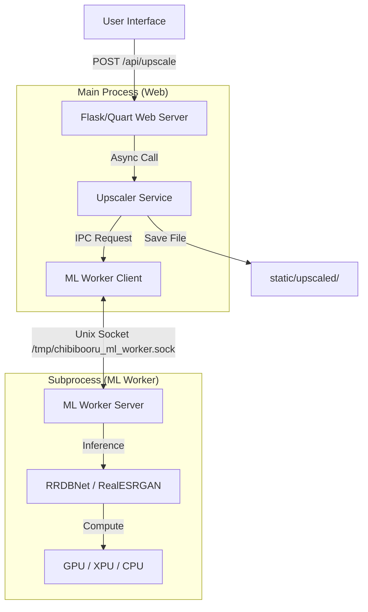

# ChibiBooru Upscaler Architecture & Inventory

**Last Updated**: 2024-12-31
**Status**: Active

## Executive Summary

The ChibiBooru Upscaler is a feature that allows users to increase the resolution of images using AI (RealESRGAN). It is designed with a **split-process architecture** to decouple heavy ML operations from the main web server. This ensures that the web interface remains responsive even during intensive GPU operations and allows for aggressive memory management (automatically unloading the ML worker when idle).

---

## Architecture Overview

The system operates on a client-server model over a local Unix domain socket:

---

## Component Inventory

### 1. Core Orchestration (Main Application)
These components run within the main web application process.

| File Path | Component | Description |
| :--- | :--- | :--- |
| **`services/upscaler_service.py`** | **Service Layer** | The primary entry point. Orchestrates the workflow, checks if upscaled images exist, manages file paths, and calls the worker client. |
| **`routers/api/upscaler.py`** | **API Controller** | Exposes REST endpoints (`POST /api/upscale`, `DELETE /api/upscale`) for the frontend to consume. |
| **`services/image_service.py`** | **Integration** | Ensures data consistency. Specifically handles **cleanup**, ensuring upscaled files are deleted when the original image is deleted. |
| **`routers/web.py`** | **View Controller** | Injects the `upscaled_image_url` context into the image page template so the UI knows to show the button/badge. |
| **`services/similarity_service.py`** | **Consumer** | Checks for `ML_WORKER_ENABLED` and attempts to import `ml_worker.client`. While primarily for similarity, it's a "customer" of the shared ML Worker infrastructure. |

### 2. ML Worker (Subprocess)
These components run in a separate, isolated process to manage memory and GPU resources.

| File Path | Component | Description |
| :--- | :--- | :--- |
| **`ml_worker/server.py`** | **Worker Server** | The "Brain". Listens for requests, lazy-loads the PyTorch model, performs inference, and saves the result. Auto-terminates when idle. |
| **`ml_worker/client.py`** | **IPC Client** | The bridge. Handles spawning the worker process if it's dead, and sending JSON requests over the socket. |
| **`ml_worker/protocol.py`** | **Protocol** | Defines the data contract (Request/Response schemas) for IPC communication. |
| **`ml_worker/backends.py`** | **Backend Manager** | Handles hardware detection (Nvidia/Intel/Apple) and environment setup (PyTorch installation directives). |

### 3. Model & Hardware
| File Path | Component | Description |
| :--- | :--- | :--- |
| **`utils/rrdbnet_arch.py`** | **Neural Network** | A standalone PyTorch implementation of the `RRDBNet` architecture (used by RealESRGAN) to avoid heavy external dependencies. |
| **`utils/gpu_detection.py`** | **Hardware Abstraction** | *Legacy/Utility* - Detects available hardware (Nvidia CUDA, Intel XPU, CPU) and determines the correct PyTorch backend to use. |
| **`models/Upscaler/`** | **Model Storage** | Directory containing upscaler model files and configurations. |

### 4. Frontend (User Interface)
| File Path | Component | Description |
| :--- | :--- | :--- |
| **`static/js/upscaler.js`** | **Client Logic** | Handles the "Magic Wand" button, polling for status, showing the dependency installer, and toggling the image view. |
| **`static/css/components/upscaler.css`** | **Styling** | Styles for the upscale button, loading spinners, and the hover menu. |
| **`templates/image.html`** | **Template** | The HTML container. Includes the hidden upscaled image view and loads the necessary scripts. |

### 5. Setup & Configuration
| File Path | Component | Description |
| :--- | :--- | :--- |
| **`config.py`** | **Configuration** | Central registry for settings (Enabled status, Model name, Directories, Timeouts). |

---

## Configuration Reference

The upscaler is controlled via `config.py` and Environment Variables (`.env`).

| Variable | Default | Description |
| :--- | :--- | :--- |
| `UPSCALER_ENABLED` | `false` | Master toggle to enable the feature. |
| `UPSCALER_MODEL` | `RealESRGAN_x4plus` | The specific model architecture to use. |
| `UPSCALED_IMAGES_DIR` | `./static/upscaled` | Storage location for output files. |
| `ML_WORKER_ENABLED` | `true` | Whether to use the subprocess architecture (Recommended). |
| `ML_WORKER_IDLE_TIMEOUT`| `300` (5 mins) | How long the worker stays alive after the last request. |
| `ML_WORKER_BACKEND` | `auto` | Forces a specific backend: `cuda`, `xpu`, `cpu`, or `auto`. |
| `ML_WORKER_SOCKET` | `/tmp/...` | Path to the Unix domain socket for IPC. |

---

## Key Workflows

### 1. Upscaling an Image
1.  **User** clicks the "Upscale" button on the UI.
2.  **Frontend** sends `POST /api/upscale` with the image path.
3.  **API** validates the request and calls `upscaler_service.upscale_image()`.
4.  **Service** instructs `ml_worker.client` to send a request.
5.  **Client** checks if the worker is running. If not, it spawns `python -m ml_worker.server`.
6.  **Worker** receives the request, loads the model (if not loaded), runs inference, and writes the file to disk.
7.  **Worker** responds with success/failure.
8.  **Frontend** receives the success response and swaps the image `src` to the new upscaled file.

### 2. Deleting an Image
1.  **User** deletes an image via the context menu.
2.  **Server** calls `image_service.delete_image_service()`.
3.  **Image Service** deletes the original file and thumbnail.
4.  **Image Service** calls `upscale_service.delete_upscaled_image()` to check for and remove any existence of an upscaled counterpart.
